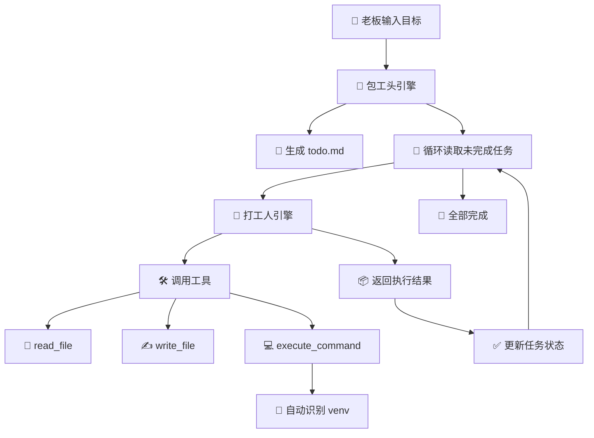

# 🧠 LTA Agent – 长序列全自动智能体（挂机版）

<p align="center">
  
  
  
</p>

<p align="center">
  <b>一个基于大语言模型的长任务自动化执行框架，支持任务拆解、状态追踪、断点续跑、自动修复错误。</b><br>
  <i>“你只管输入宏大目标，剩下的交给 LTA。” 🚀</i>
</p>

---

## 📦 项目简介

**LTA Agent** 是一个轻量级的自动化智能体框架，旨在将复杂的项目目标自动拆解为一系列可执行子任务，并逐项执行，支持：

- ✅ 自动生成任务清单（`todo.md`）
- ✅ 任务拆解与细化（支持递归拆分）
- ✅ 文件读写、命令行执行
- ✅ 自动识别虚拟环境（`venv`）
- ✅ 任务状态追踪（`[ ]` / `[x]` / `[FAILED]`）
- ✅ 断点续跑（支持中断后继续执行）

---

## 🧱 系统架构图



---

## 🛠️ 功能特性

- 📄 **自动生成任务清单**：根据你的目标自动生成 `todo.md`
- 🔁 **递归任务拆解**：如果任务太复杂，AI 会自动拆成更细的步骤
- 🧪 **自动修复错误**：任务失败时 AI 会尝试分析并修复
- 🧰 **内置工具函数**：
  - `read_file(filename)`
  - `write_file(filename, content)`
  - `execute_command(command)`
- 🧪 **虚拟环境自动适配**：自动识别并使用 `venv` 中的 `python` / `pip`
- 🧵 **串行工具调用**：防止 API 并发调用导致的混乱
- 🧠 **大模型驱动**：基于 OpenAI API（兼容中转接口）

---

## 🚀 快速开始

### 1. 克隆项目

```bash
git clone https://github.com/yourname/lta-agent.git
cd lta-agent
```

### 2. 安装依赖

```bash
pip install -r requirements.txt
```

### 3. 配置环境变量

创建 `.env` 文件：

```env
OPENAI_API_KEY=your-api-key
OPENAI_BASE_URL=https://api.openai.com/v1
MODEL_NAME=gpt-4o
```

### 4. 启动智能体

```bash
python lta_agent.py
```

然后输入你的目标，例如：

```
👑 [老板指令] 请输入您的宏大项目需求:
> 写一个 Python 脚本，读取当前目录下的所有 CSV 文件，合并后输出为 merged.csv
```

系统会自动生成任务清单并开始执行 ✅

---

## 📁 文件说明

| 文件 | 说明 |
|------|------|
| `lta_agent.py` | 主程序入口 |
| `todo.md` | 自动生成的任务清单（可手动修改） |
| `.env` | 环境变量配置文件 |
| `requirements.txt` | Python 依赖 |

---

## 🧪 示例输出

```
🎯 [包头工分派任务] -> 创建虚拟环境 venv
  👷 [打工人] 开始执行: 创建虚拟环境 venv
    🛠️ [调用工具] execute_command | python -m venv venv
  ✅ [打工人汇报]: 虚拟环境创建成功
✒️ [包工头] 任务顺利完成，已在 todo.md 中打钩 [x]！
```

---

## ⚠️ 注意事项

- 请确保 `.env` 中的 API Key 正确且可用
- 支持自定义中转接口（如 `https://api.openai-proxy.org/v1`）
- 默认模型为 `gpt-4o`，可在 `.env` 中修改
- 每个子任务最多执行 15 轮工具调用，防止死循环
- 超大文件读取会被截断（默认 12000 字符）

---

## 🤝 贡献指南

欢迎提交 Issue 或 PR！如果你有好的想法或改进建议，欢迎一起完善这个项目。
